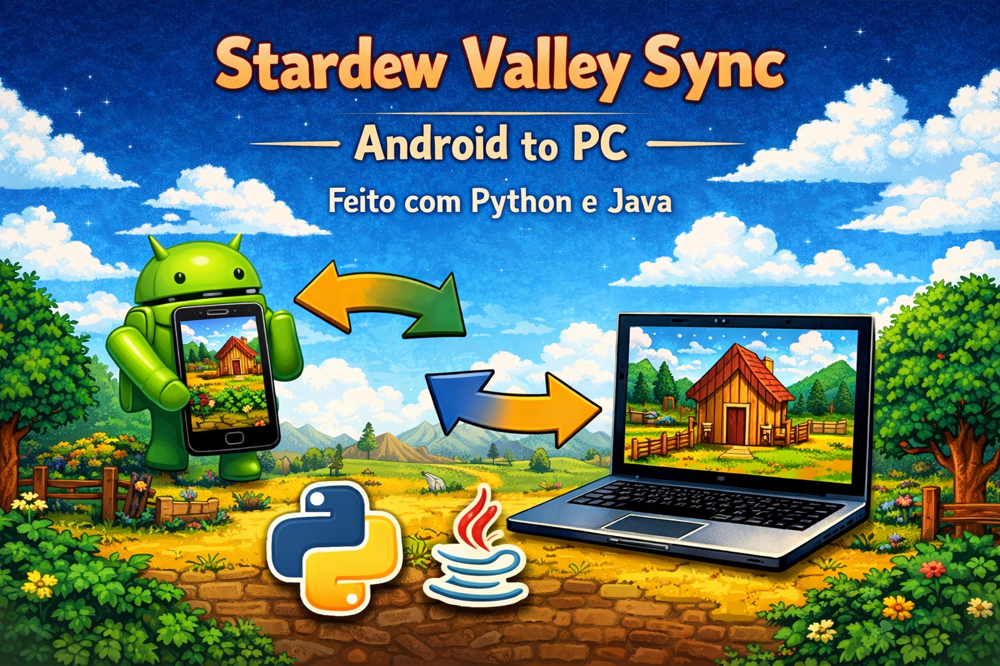

# 🧑‍🌾 StardewSync

> **Sincronizador automático de saves entre PC e Mobile para Stardew Valley.**

O **StardewSync** é uma solução de engenharia de software desenvolvida para resolver a fragmentação de progresso entre as versões de Desktop e Mobile do jogo. Utilizando a API do Google Drive como ponte, o sistema garante que o progresso da sua fazenda esteja sempre atualizado em qualquer dispositivo.

## 🚀 Status da Sprint
Atualmente no final da **Sprint 1**, com a camada de serviço local concluída e a infraestrutura cloud configurada.

## 🏗️ Arquitetura do Sistema
O projeto segue princípios de **Clean Code** e **SOLID**, dividindo a responsabilidade em camadas claras:

* **Camada de Modelo (Entities):** Utilização de `dataclasses` para representação dos dados da fazenda (`FarmSave`).
* **Camada de Serviço (Services):** `SaveManagerService` encapsula a lógica de I/O e parsing de XML.
* **Camada de Nuvem:** Integração via Google Drive API com autenticação OAuth 2.0.

## 📋 Funcionalidades Implementadas (Sprint 1)
- [x] Localização automática do diretório `%AppData%\StardewValley\Saves`.
- [x] Parsing técnico de arquivos XML para extração de metadados do jogador.
- [x] Modelagem de objetos tipados para trânsito de informações entre plataformas.
- [x] Configuração de projeto e escopos de segurança na Google Cloud Platform.

## 🛠️ Tecnologias Utilizadas
* **Desktop:** Python 3.x (Pandas, ElementTree).
* **Mobile:** Java (Android Studio - Scoped Storage/SAF).
* **Cloud:** Google Drive API v3.
* **Gestão:** Jira (Scrum).
---
Desenvolvido por Sannyer Cardoso Carvalho Nery - Tecnologo em Análise e Desenvolvimento de Sistemas.